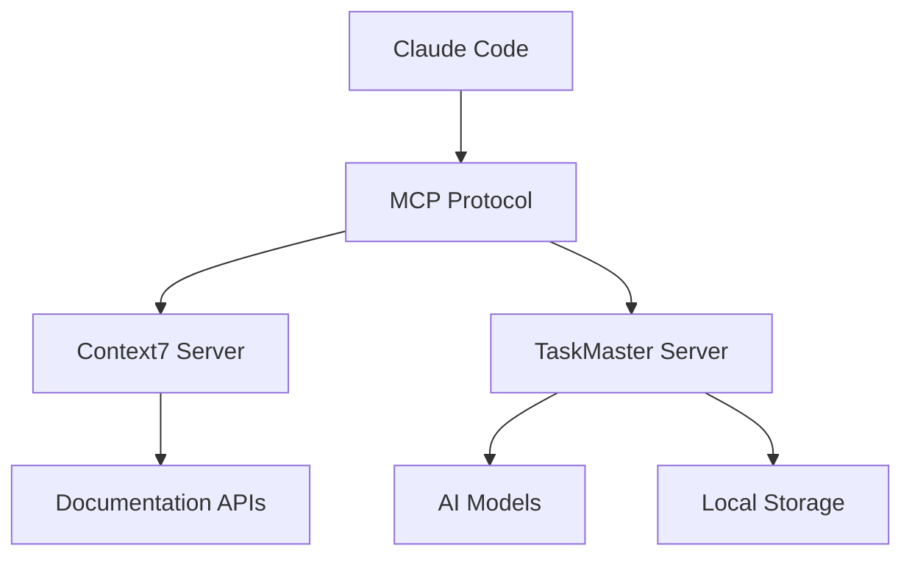

# Configuração Detalhada dos MCPs

## 📋 Índice
1. [Context7 MCP](#context7-mcp)
2. [TaskMaster AI MCP](#taskmaster-ai-mcp)
3. [Arquitetura dos MCPs](#arquitetura-dos-mcps)
4. [Configurações Avançadas](#configurações-avançadas)
5. [Integração com IDEs](#integração-com-ides)

## 🔍 Context7 MCP

### O que é Context7?
Context7 é um servidor MCP que fornece acesso a documentação em tempo real de bibliotecas e frameworks populares.

### Configuração Básica
```json
{
  "context7": {
    "type": "stdio",
    "command": "npx",
    "args": ["-y", "@upstash/context7-mcp"],
    "env": {}
  }
}
```

### Como Funciona
1. **Requisição**: Quando você adiciona "use context7" em uma pergunta
2. **Busca**: Context7 busca na documentação oficial mais recente
3. **Resposta**: Retorna informações atualizadas e exemplos de código

### Bibliotecas Suportadas
- React, Next.js, Vue.js
- Node.js, Express, Fastify
- TypeScript, JavaScript
- Tailwind CSS, Material-UI
- Python (Django, Flask)
- E muitas outras...

### Exemplos de Uso
```bash
# Documentação básica
"Como usar useState no React? use context7"

# Versão específica
"Como migrar para Next.js 14? use context7"

# Comparações
"Diferenças entre useEffect e useLayoutEffect? use context7"
```

### Dicas de Uso
- Seja específico com o nome da biblioteca
- Mencione versões quando relevante
- Use para verificar APIs deprecadas
- Combine com perguntas de implementação

## 📊 TaskMaster AI MCP

### O que é TaskMaster AI?
Sistema inteligente de gerenciamento de projetos que transforma requisitos em tarefas estruturadas.

### Configuração Básica
```json
{
  "taskmaster-ai": {
    "type": "stdio",
    "command": "npx",
    "args": ["task-master-ai"],
    "env": {}
  }
}
```

### Configuração com APIs Externas
```json
{
  "taskmaster-ai": {
    "type": "stdio",
    "command": "npx",
    "args": ["task-master-ai"],
    "env": {
      "PERPLEXITY_API_KEY": "pplx-xxx",
      "OPENAI_API_KEY": "sk-xxx",
      "GOOGLE_API_KEY": "AIza-xxx"
    }
  }
}
```

### Estrutura de Diretórios do TaskMaster
```
projeto/
└── .taskmaster/
    ├── config.json           # Configuração do projeto
    ├── docs/
    │   ├── prd.txt          # Product Requirements Document
    │   └── research/        # Pesquisas técnicas
    ├── tasks/
    │   ├── tasks.json       # Base de dados de tarefas
    │   └── task-*.md        # Detalhes individuais
    └── reports/
        └── complexity-*.json # Relatórios de análise
```

### Modelos Disponíveis

#### Configuração de Modelos
```json
{
  "models": {
    "main": {
      "provider": "claude-code",
      "modelId": "sonnet",
      "maxTokens": 32000,
      "temperature": 0.2
    },
    "research": {
      "provider": "perplexity",
      "modelId": "llama-3.1-sonar-large-32k-online",
      "temperature": 0.1
    },
    "fallback": {
      "provider": "google",
      "modelId": "gemini-2.0-flash",
      "temperature": 0.2
    }
  }
}
```

#### Providers Suportados
- **claude-code**: Integração nativa
- **openai**: GPT-4, GPT-3.5
- **google**: Gemini Pro, Flash
- **perplexity**: Sonar (com busca web)
- **anthropic**: Claude direto
- **ollama**: Modelos locais

### Comandos do TaskMaster

#### Comandos de Setup
```bash
/project-setup          # Inicialização completa
/models                 # Configurar/verificar modelos
/rules add cursor       # Adicionar regras específicas
```

#### Comandos de Planejamento
```bash
/create-prd            # Criar PRD interativo
/update-prd            # Atualizar requisitos
/parse-prd             # Gerar tarefas do PRD
```

#### Comandos de Desenvolvimento
```bash
/task-status           # Dashboard do projeto
/next-task             # Próxima tarefa
/complete-task [id]    # Marcar como concluída
/quick-task "desc"     # Adicionar tarefa rápida
```

#### Comandos de Análise
```bash
/complexity            # Análise de complexidade
/break-down [id]       # Dividir tarefa
/research [topic]      # Pesquisa técnica
```

## 🏗️ Arquitetura dos MCPs

### Como os MCPs se Comunicam



### Protocolo de Comunicação
1. **stdio**: Comunicação via entrada/saída padrão
2. **JSON-RPC**: Mensagens estruturadas
3. **Async**: Operações não-bloqueantes

### Ciclo de Vida de uma Requisição
```
1. User Input → Claude Code
2. Claude Code → MCP Router
3. MCP Router → Appropriate Server
4. Server Processing
5. Response → Claude Code
6. Claude Code → User
```

## ⚙️ Configurações Avançadas

### Multi-Provider Setup
```json
{
  "mcpServers": {
    "context7": {
      "type": "stdio",
      "command": "npx",
      "args": ["-y", "@upstash/context7-mcp"]
    },
    "taskmaster-ai": {
      "type": "stdio",
      "command": "npx",
      "args": ["task-master-ai"],
      "env": {
        "PERPLEXITY_API_KEY": "${PERPLEXITY_API_KEY}",
        "OPENAI_API_KEY": "${OPENAI_API_KEY}"
      }
    },
    "custom-mcp": {
      "type": "stdio",
      "command": "python",
      "args": ["/path/to/custom-mcp.py"]
    }
  }
}
```

### Configuração por Projeto
```bash
# Em cada projeto, criar .claude/config.json
{
  "mcpServers": {
    // Configurações específicas do projeto
  },
  "inherit": true  // Herdar configurações globais
}
```

### Debug e Logs
```bash
# Ativar modo debug
export MCP_DEBUG=1

# Ver logs detalhados
claude --log-level debug

# Logs do TaskMaster
cat ~/.claude/.taskmaster-global/logs/taskmaster.log
```

## 🔗 Integração com IDEs

### VS Code / Cursor
```json
// .cursor/mcp.json ou .vscode/mcp.json
{
  "mcpServers": {
    "context7": {
      "command": "npx",
      "args": ["-y", "@upstash/context7-mcp"]
    }
  }
}
```

### Configuração do Workspace
```json
// .vscode/settings.json
{
  "claude.mcpServers": {
    "enabled": true,
    "autoStart": true
  }
}
```

### Integração com Git Hooks
```bash
# .git/hooks/pre-commit
#!/bin/bash
# Atualizar status das tarefas antes do commit
claude /task-status --update
```

## 🔒 Segurança e Boas Práticas

### Gerenciamento de Secrets
```bash
# Usar arquivo .env
PERPLEXITY_API_KEY=xxx
OPENAI_API_KEY=xxx

# Carregar no MCP
"env": {
  "PERPLEXITY_API_KEY": "${PERPLEXITY_API_KEY}"
}
```

### Isolamento de Ambientes
```bash
# Desenvolvimento
~/.claude/config.dev.json

# Produção
~/.claude/config.prod.json

# Alternar
export CLAUDE_CONFIG=~/.claude/config.dev.json
```

### Backup de Configurações
```bash
# Backup automático
cp ~/.claude.json ~/.claude.json.backup.$(date +%Y%m%d)

# Restaurar
cp ~/.claude.json.backup.20240115 ~/.claude.json
```

## 📊 Métricas e Monitoramento

### Monitorar Uso do Context7
```bash
# Ver estatísticas de uso
claude stats context7

# Queries mais comuns
claude stats context7 --top-queries
```

### Métricas do TaskMaster
```bash
# Produtividade
/task-status --metrics

# Tempo médio por tarefa
/complexity --time-analysis
```

## 🚀 Otimização de Performance

### Cache do Context7
```json
{
  "context7": {
    "env": {
      "CACHE_TTL": "3600",     // 1 hora
      "MAX_CACHE_SIZE": "100MB"
    }
  }
}
```

### Paralelização do TaskMaster
```json
{
  "taskmaster-ai": {
    "env": {
      "PARALLEL_TASKS": "5",
      "BATCH_SIZE": "10"
    }
  }
}
```

---

**Próximos Passos**: Veja o [Guia de Comandos](COMMANDS.md) para aprender todos os comandos disponíveis.